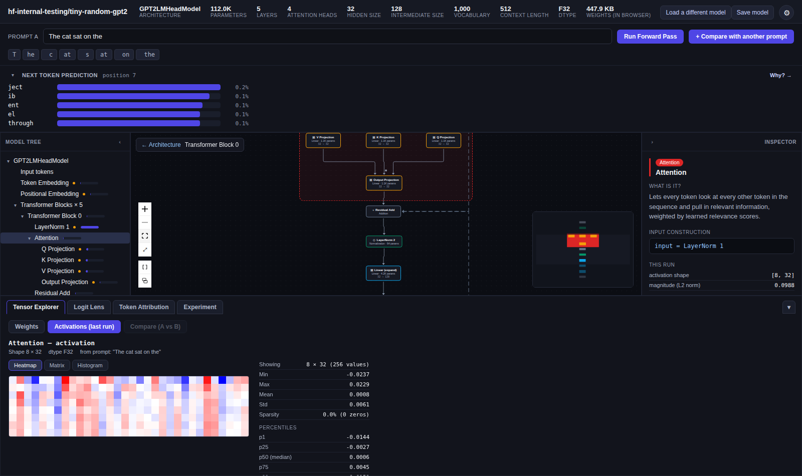

# Tensorium

An interactive, in-browser explorer and debugger for large language model
internals. Point it at a Hugging Face repo that ships `safetensors`
weights for one of the [supported architectures](#supported-architectures)
(GPT-2, Llama, Mistral, Gemma, Qwen2, Qwen3, or Phi-3/4) and it parses the
model's real config and weights, renders its architecture as a navigable
graph, runs an actual forward pass in the browser (no backend, no GPU),
and lets you inspect every tensor, watch predictions form layer by layer,
and run causal interventions (ablate a head, patch in an activation from
another prompt) to see what actually drives the model's output.

Everything runs client-side. Weights are fetched directly from the
Hugging Face CDN and executed with a small dependency-free numeric engine
written in TypeScript. Fetched files are cached in the browser's IndexedDB
(keyed by their exact URL), so reloading the same repo later needs no
network round trip at all — files over 50 MB are never written to that
cache and always come straight from Hugging Face instead.



Note: the built-in presets are tiny, randomly-initialized test checkpoints,
not real trained models — predictions won't be coherent. This tool is for
exploring architecture and mechanics, not model quality.

## Features

- **Load any compatible Hugging Face model** by repo id — no upload, no
  server-side processing. Eight architecture families are supported out
  of the box (see [Supported architectures](#supported-architectures)).
  Alternatively, pick a local `config.json` + `.safetensors` (+ optional
  `tokenizer.json`) straight off disk — each file is content-sniffed
  before loading (not just trusted by extension) to catch a mislabeled or
  corrupt file immediately, with a size warning for very large weight
  files. A **Save model** button downloads the loaded model's exact
  original bytes back out, behind a confirmation dialog that names every
  file and its size before anything downloads.
- **Architecture graph** — the model rendered as a node graph (via React
  Flow) at two levels of detail: the full architecture, and a
  double-click-to-expand view of a single transformer block's internal
  wiring (attention projections, norms, MLP, residual adds). Selecting a
  container node (e.g. Attention) draws a scope box around its leaf
  components; a graph control can collapse repeated same-type chains
  (e.g. 5 transformer blocks) into a single stacked node for a more
  condensed view, and toggle back to the expanded chain on demand. A
  built-in export button renders the full graph (not just the visible
  viewport) to a PNG.
- **Model tree** — a classic collapsible tree view of every module and
  parameter, alongside the graph.
- **Inspector** — click any component for a plain-language explanation of
  what it does, its input/output shapes, its parameters, and (where it can
  be determined unambiguously) an Input Construction breakdown showing the
  math behind how its input was assembled (e.g. token embedding +
  positional embedding).
- **Tensor Explorer** — browse every weight tensor and every activation
  captured from the last forward pass, rendered as a heatmap, a raw
  matrix, or a value histogram. Supports windowing into large tensors and
  side-by-side A/B/diff comparison across two prompts.
- **Logit Lens** — project every layer's hidden state through the final
  norm and LM head to watch the model's next-token prediction sharpen (or
  change its mind) layer by layer.
- **Token Attribution** — occlusion-based attribution: mask each input
  token in turn and measure how much the prediction shifts, to see which
  tokens actually mattered.
- **Experiment panel** — causal interventions on a real forward pass:
  zero out a component, zero a single attention head, or patch in an
  activation captured from a second prompt, and see the before/after
  effect on the output distribution.
- **Themes and language** — dark, light, pastel, and sepia themes, plus a
  UI translated into nine languages, both configurable from the settings
  panel (top-right gear icon).
- **Resizable, collapsible layout** — drag the bottom panel's top edge to
  resize it (within sane min/max bounds); it and the tree/inspector/
  prediction panels each collapse independently, and every size/collapse
  preference persists across reloads.

## How it works

The core design is a normalized **Model IR** (intermediate representation)
that every architecture is translated into, so the UI never has to know
whether it's looking at GPT-2, Llama, or Qwen — only the small
architecture-specific *adapter* that produced the graph does.

```
Hugging Face repo (config.json + *.safetensors)
        │
        ▼
  Model Adapter            canLoad() picks the right adapter for the repo's
  (per architecture)       model_type / architectures field
        │
        ▼
  Model IR                 Model / ModelNode / ParameterRef / WeightProvider
  (packages/model-ir)      — a normalized graph + lazy tensor access, the
        │                    same shape regardless of source architecture
        ▼
  nn-ops + adapter's        a real forward pass (matmul, RMSNorm/LayerNorm,
  runInference()             RoPE, GQA/MQA attention, SwiGLU/GELU MLPs...),
                              capturing every intermediate activation
        │
        ▼
  React UI                 graph view, tensor explorer, logit lens, token
  (apps/web)                attribution, and intervention experiments — all
                              driven purely by the IR + captured activations
```

A `ParameterRef` can also be a named *slice* of a larger underlying
tensor — the mechanism that lets one shared engine model both
non-fused checkpoints and checkpoints that fuse multiple projections into
one weight (GPT-2's `c_attn`, Phi's `qkv_proj`/`gate_up_proj`) without
special-casing the rest of the pipeline.

Most of the supported architectures (Llama, Mistral, Gemma, Qwen2/2.5,
Qwen3, Phi-3/4) are RoPE + RMSNorm + gated-MLP "Llama-shaped" models that
differ only in a handful of concrete details (GQA ratio, an explicit
`head_dim`, a bias here, a fused projection there). Rather than
duplicating the graph-building and forward-pass code per architecture,
they're all thin wrappers around one shared, option-parameterized engine
(`adapter-llama-family`) — see [Adding a new
architecture](#adding-a-new-architecture).

## Project layout

```
packages/
  model-ir/              Normalized graph types: Model, ModelNode, ParameterRef,
                          WeightProvider, ActivationCapture, Intervention.
  tensor-core/            Safetensors parsing, dtype decoding, tensor statistics,
                          the WeightProvider implementation.
  hf-client/              Shared Hugging Face fetch helpers (config.json + the
                          safetensors header).
  nn-ops/                 Dependency-free numeric primitives for running a real
                          forward pass in JS: matmul, LayerNorm/RMSNorm, RoPE,
                          causal/GQA attention, GELU/SiLU, and intervention
                          application (ablation/patching).
  tokenizer/              From-scratch BPE tokenizer reading Hugging Face's
                          tokenizer.json (handles GPT-2, Llama/SentencePiece-style,
                          and Qwen's tokenizer.json shapes).
  interpretability/       Logit lens and occlusion-based token attribution, built
                          on top of runInference()'s captured activations.
  model-adapters/
    gpt2/                 Architecture-specific: config -> Model IR, weight name
                          mapping, forward pass.
    llama-family/          Shared engine for every Llama-shaped architecture
                          (RoPE, RMSNorm, gated FFN, GQA), parameterized by each
                          architecture's real differences.
    llama/                 Thin wrapper over llama-family.
    mistral/                Thin wrapper over llama-family (real GQA ratios).
    gemma/                  Wrapper with explicit head_dim, a (1+weight) RMSNorm
                          variant, and √hidden_size embedding scaling.
    qwen/                   Wrapper with a bias on Q/K/V projections.
    qwen3/                  Wrapper with QK-Norm (per-head RMSNorm on Q/K before
                          RoPE).
    phi/                    Wrapper with fused qkv_proj and gate_up_proj
                          projections (via ParameterRef slicing).
    glm4/                   Wrapper with a sandwich norm (extra RMSNorm after
                          each sub-layer's output, before the residual add)
                          and partial rotary (RoPE applied to only a leading
                          slice of each head).
apps/
  web/                    React + React Flow UI: tree / architecture graph /
                          inspector / tensor explorer / inference panel / logit
                          lens / token attribution / experiment panel / settings
                          (themes + language).
```

## Supported architectures

| Architecture | Adapter | Example checkpoint used as a built-in preset |
|---|---|---|
| GPT-2 | `adapter-gpt2` | [`hf-internal-testing/tiny-random-gpt2`](https://huggingface.co/hf-internal-testing/tiny-random-gpt2) |
| Llama | `adapter-llama` | [`hf-internal-testing/tiny-random-LlamaForCausalLM`](https://huggingface.co/hf-internal-testing/tiny-random-LlamaForCausalLM) |
| Mistral | `adapter-mistral` | [`yujiepan/mistral-tiny-random`](https://huggingface.co/yujiepan/mistral-tiny-random) |
| Gemma | `adapter-gemma` | [`fxmarty/tiny-random-GemmaForCausalLM`](https://huggingface.co/fxmarty/tiny-random-GemmaForCausalLM) |
| Qwen2 / 2.5 | `adapter-qwen` | [`yujiepan/qwen2-tiny-random`](https://huggingface.co/yujiepan/qwen2-tiny-random) |
| Qwen3 | `adapter-qwen3` | [`tiny-random/qwen3`](https://huggingface.co/tiny-random/qwen3) |
| Phi-3 / Phi-4 | `adapter-phi` | [`tiny-random/phi-4`](https://huggingface.co/tiny-random/phi-4) |
| GLM-4 | `adapter-glm4` | [`tiny-random/glm-4`](https://huggingface.co/tiny-random/glm-4) |

These are all deliberately tiny (randomly-initialized, few-layer) test
checkpoints, chosen so the full model can be loaded and explored instantly
in a browser tab. Any other repo with the same `model_type` and a
`model.safetensors` file will work too — type its repo id into the loader
instead of picking a preset. DeepSeek-LLM, for example, needs no adapter of
its own: its `config.json` reports `model_type: "llama"` (it predates
DeepSeek's MoE/latent-attention architectures), so `adapter-llama` already
loads it — see
[`yujiepan/deepseek-llm-tiny-random`](https://huggingface.co/yujiepan/deepseek-llm-tiny-random).

Full-size, multimodal, active-MoE, or state-space/hybrid architectures
(e.g. Gemma 3n/4, GLM-4.5V, GLM-5, Qwen-VL, Llama 4, Phi-4-flash, Bamba)
aren't supported yet — they need either genuinely large-checkpoint
streaming or Model IR extensions this project doesn't have yet
(Mixture-of-Experts routing, multi-head latent attention, vision towers,
Mamba/state-space
layers), rather than just another adapter.

## Getting started

### Prerequisites

- Node.js 22.12+ (see `.nvmrc`)
- npm (this is an npm-workspaces monorepo)

### Install

```bash
npm install
```

### Run in development

```bash
npm run dev
```

Open the printed `http://localhost:5173` URL. A tiny GPT-2 checkpoint
loads by default; pick any other preset from the loader screen, or type a
Hugging Face repo id directly.

### Build for production

```bash
npm run build
```

### Type-check the whole workspace

```bash
npm run typecheck
```

### Run with Docker

No Node.js install needed — this builds the static production bundle in
a `node:22-alpine` stage and serves it with `nginx:alpine`:

```bash
docker build -t tensorium .
docker run --rm -p 8080:80 tensorium
```

Then open `http://localhost:8080`. Since the whole app is a static
client-side bundle, this container has no backend and holds no state —
it's just a file server.

## Usage

1. **Load a model** — pick a preset (sorted alphabetically) or type a
   `org/model-name` repo id and click Load.
2. **Explore the architecture** — click any node in the graph or tree to
   inspect it; double-click a transformer block to drop into its internal
   wiring, and use the breadcrumb to step back out.
3. **Run a forward pass** — type a prompt and click *Run Forward Pass* to
   populate activations throughout the graph. Add a second prompt via *+
   Compare with another prompt* to unlock A/B/diff views — Prompt B gets
   its own next-token prediction panel, and a source toggle inside Logit
   Lens and Token Attribution switches between analyzing Prompt A or B.
4. **Analyze** — switch between the four bottom tabs:
   - **Tensor Explorer** for raw weights/activations,
   - **Logit Lens** for the evolving next-token prediction,
   - **Token Attribution** for which input tokens mattered,
   - **Experiment** for causal interventions (zero/patch a component or
     head and see the effect on the output).
5. **Customize** — open the settings panel (gear icon, top-right) to
   switch theme or UI language.

## Adding a new architecture

1. Write a new package under `packages/model-adapters/`, implementing the
   `ModelAdapter` interface from `@tensorium/model-ir` (`canLoad`,
   `loadMetadata`, `buildGraph`, `getWeightProvider`, `runInference`).
2. If the architecture is Llama-shaped (RoPE + RMSNorm + gated FFN — most
   are), it's very likely a thin wrapper over `adapter-llama-family`
   rather than new graph/inference code — see the `mistral` package for
   the minimal case and `gemma`/`phi` for ones with real option overrides
   (embedding scaling, fused projections, QK-Norm, etc). Otherwise,
   implement `buildGraph`/`runInference` directly with
   `@tensorium/nn-ops`'s primitives.
3. Register the adapter (and, optionally, a preset checkpoint) in
   `apps/web/src/adapters.ts`.

Nothing in the UI needs to change: the graph renderer, inspector, tensor
viewer, logit lens, and token attribution are all driven by the generic
`NodeType`/`ActivationCapture`/`Intervention` contracts in the Model IR,
not by which adapter produced them.

## Verifying correctness

Every adapter's forward pass, tokenizer, and intervention behavior is
checked against real output from Python/PyTorch and Hugging Face's
`transformers` library — not just "does it run." Numeric outputs
typically match reference values to ~1e-6/1e-7 for F32/BF16 checkpoints,
and interventions are checked against genuine PyTorch forward hooks
(register_forward_hook / register_forward_pre_hook), not just this
project's own reimplementation of the same idea.

## Known limitations

- Weights are downloaded as one in-memory buffer per model — fine for the
  tiny checkpoints this app targets, but a multi-GB checkpoint needs a
  backend doing true HTTP range reads behind the same `WeightProvider`
  interface, which isn't implemented yet.
- Inference is a single forward pass, not autoregressive generation.
- The tokenizer doesn't handle special/added tokens, and has a known gap
  with unusual (doubled) whitespace against SentencePiece-style
  normalizers.
- The Gemma adapter is scoped to Gemma 1 only; Gemma 2/3 add real
  architectural differences (sandwich norms, alternating attention, logit
  softcapping) it doesn't implement.
- Mistral's sliding-window attention isn't modeled.
- Multimodal and active-MoE architectures aren't supported (see
  [Supported architectures](#supported-architectures)).
- Token attribution is occlusion-based only — no gradient-based
  attribution.
- The IndexedDB cache is per-browser, not shared across users or devices —
  it just saves a repeat visitor's own re-downloads, not bandwidth across
  everyone loading the app.
- No persistence: experiments, comparisons, and logit-lens runs live only
  in browser state for the current session.

## Credits

This project only exists because of the open model architectures and
tiny test checkpoints Hugging Face and its community publish. Particular
thanks to the maintainers of the preset checkpoints used above:
[`hf-internal-testing`](https://huggingface.co/hf-internal-testing),
[`yujiepan`](https://huggingface.co/yujiepan),
[`fxmarty`](https://huggingface.co/fxmarty), and the
[`tiny-random`](https://huggingface.co/tiny-random) org — and to Hugging
Face for `transformers`, `safetensors`, and the model hub that makes a
config.json + safetensors pair a reliable, inspectable source of truth
for a given architecture.

The architecture graph is rendered with [React
Flow](https://reactflow.dev/).

## License

[MIT](LICENSE)
